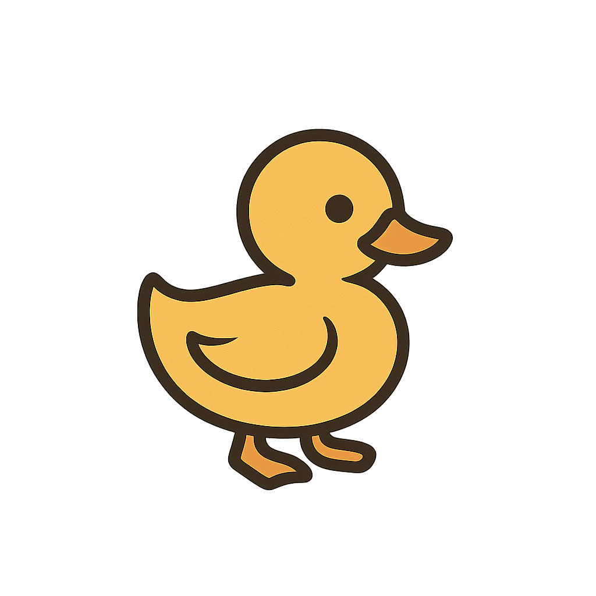

# Duckling 🐥

<p align="center">
  
</p>

**Duckling** is an automated coding assistant that wraps CLI coding tools (OpenAI Codex and Amp Code) to automate your entire development workflow from task assignment to PR merge.

## Features

- 🤖 **AI-Powered Code Generation** - Integrates with Amp and OpenAI Codex
- 🔄 **Complete Workflow Automation** - From task creation to PR merge
- 🌐 **Web Interface** - Modern, responsive UI for task management
- 📱 **Real-time Updates** - Live progress tracking via Server-Sent Events
- 🔧 **Precommit Checks** - Automated code quality enforcement
- 📊 **Task Management** - Comprehensive tracking and logging
- 🛠️ **CLI Interface** - Command-line tools for automation
- 🔐 **Secure Configuration** - Local SQLite storage for all settings

## Quick Start

### Prerequisites

- Node.js 18+ 
- Git repository (for task execution)
- At least one coding assistant CLI tool installed:
  - [Amp](https://www.amp.build/) - Requires Amp token
  - [OpenAI CLI](https://platform.openai.com/docs/guides/cli) - Requires OpenAI API key

### Installation

```bash
# Clone or download the project
cd duckling

# Install dependencies
npm install

# Build the project
npm run build

# Start Duckling
npx duckling start
```

### First-Time Setup

1. Visit http://localhost:3000
2. Configure your settings:
   - **API Keys**: Configure your GitHub token and coding assistant API key
   - **GitHub Settings**: Set your GitHub username
   - **Preferences**: Customize branch prefixes, retry limits, etc.

⚠️ **Important**: You must configure at least one coding tool and your GitHub settings before creating tasks.

### Creating Your First Task

#### Via Web Interface
1. Go to http://localhost:3000
2. Click "New Task"
3. Fill in title, description, and select coding tool
4. Click "Create Task"

*Note: If you haven't configured your coding tools, you'll be prompted to visit the settings page first.*

#### Via CLI
```bash
npx duckling task create
```

## How Duckling Works

Duckling automates your development workflow in these steps:

1. **Task Creation** - You describe what you want implemented
2. **Branch Creation** - Automatically creates a feature branch (`duckling/your-task`)
3. **Code Generation** - Uses your chosen AI assistant (Amp or OpenAI) to write code
4. **Precommit Checks** - Runs linting, tests, and type checking automatically
5. **PR Creation** - Creates a pull request with the generated code
6. **Review Loop** - Monitors PR comments and iterates based on feedback
7. **Completion** - Marks task complete when PR is merged

## Configuration Requirements

### Required Settings

Before you can create tasks, you need to configure:

**For Amp Users:**
- ✅ GitHub Token (with `repo` permissions)
- ✅ Amp API Token  
- ✅ OpenAI API Key (for commit messages and summaries)
- ✅ GitHub Username

**For OpenAI Users:**
- ✅ GitHub Token (with `repo` permissions)
- ✅ OpenAI API Key
- ✅ GitHub Username

### Getting API Keys

- **GitHub Token**: Create at https://github.com/settings/personal-access-tokens
- **Amp Token**: Get from your Amp dashboard
- **OpenAI API Key**: Get from https://platform.openai.com/api-keys

### Optional Settings

- **Branch Prefix**: Prefix for generated branches (default: `duckling/`)
- **PR Title Prefix**: Prefix for PR titles (default: `[DUCKLING]`)
- **Maximum Retries**: Retry limit for failed operations (default: 3)
- **Auto-merge**: Automatically merge PRs when checks pass (default: false)


## Usage

### Web Interface

The web interface provides a complete task management experience:

- **Dashboard**: View all tasks with filtering and search
- **Task Details**: Monitor progress, view logs, and manage tasks
- **Settings**: Configure API keys, preferences, and precommit checks
- **Real-time Updates**: Live progress tracking as tasks execute

### CLI Commands

```bash
# Start the web server
duckling start [--port 3000]

# Check system status
duckling status

# Task management
duckling task create          # Interactive task creation
duckling task list           # List all tasks
duckling task cancel <id>     # Cancel a specific task

# Configuration
duckling config              # Check configuration status
```

## Precommit Checks

Configure custom precommit checks in the settings to ensure code quality:

```bash
# Example checks
npm run type-check    # TypeScript type checking
npm run lint          # ESLint
npm test             # Unit tests
```

## Architecture

### System Components

- **Core Engine**: Main orchestration with retry logic and timeout-based processing
- **Express API**: RESTful backend with real-time Server-Sent Events
- **SQLite Database**: Local storage for all data
- **Task Queue**: Prevents overlapping operations with proper scheduling
- **Frontend**: Plain HTML/CSS/JS single-page application
- **CLI**: Command-line interface for automation

### Data Storage

All data is stored locally in `~/.duckling/`:
```
~/.duckling/
├── duckling.db          # SQLite database
└── logs/                # Application logs
```

### Technology Stack

- **Backend**: TypeScript, Express.js, SQLite
- **Frontend**: Vanilla JavaScript, Tailwind CSS
- **CLI**: Commander.js
- **Git Operations**: simple-git
- **GitHub Integration**: Octokit
- **Process Management**: execa

## Development

### Setup

```bash
# Install dependencies
npm install

# Development mode (auto-reload)
npm run dev

# Build TypeScript
npm run build

# Type checking
npm run type-check

# Linting
npm run lint
```

### Project Structure

```
src/
├── api/              # Express.js API routes and server
├── cli/              # Command-line interface
├── core/             # Core business logic
├── types/            # TypeScript type definitions
└── utils/            # Utility functions

public/
├── js/               # Frontend JavaScript
├── css/              # Stylesheets
├── assets/           # Images and static assets
└── index.html        # Main HTML file
```

## Troubleshooting

### Common Issues

**Configuration Missing**
- Visit the settings page to configure required API keys
- Ensure you have both GitHub token and at least one coding tool configured

**Database Locked**
- Ensure only one Duckling instance is running
- Check for zombie processes: `ps aux | grep duckling`

**Git Errors**
- Verify working directory is a git repository
- Check git configuration and permissions

**API Failures**
- Verify API keys are correct and have proper permissions
- Check network connectivity and rate limits

**CLI Tool Missing**
- Install the required coding assistant CLI
- Ensure it's in your PATH: `amp --version` or check OpenAI CLI

### Getting Help

- Check the logs in `~/.duckling/logs/`
- Use `duckling status` to verify configuration
- View detailed task logs in the web interface
- Check the GitHub repository for issues and documentation

## Security

- API keys are stored locally in SQLite with restricted file permissions
- No secrets are transmitted over the network unnecessarily
- All external API calls use secure HTTPS connections
- Input validation on all user-provided data
