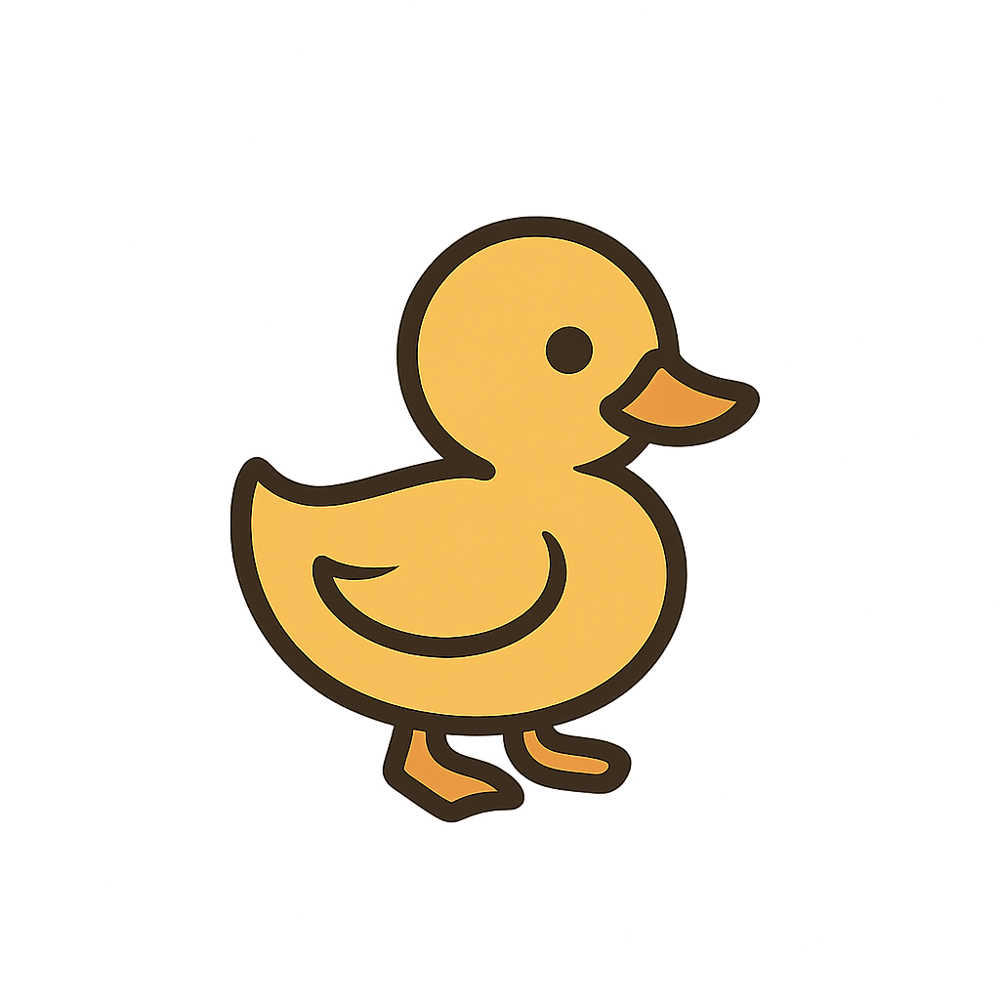
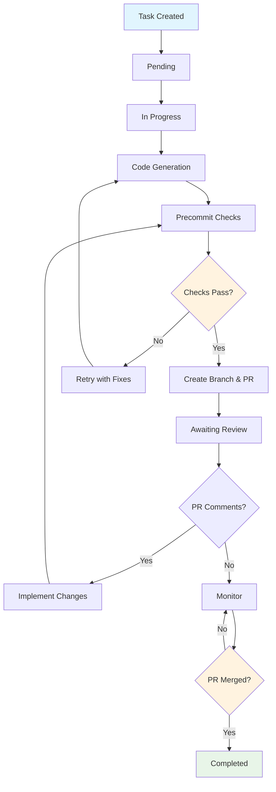

# Duckling

<p align="center">
  
</p>

**Duckling** is an automated asynchronous coding assistant that wraps CLI coding tools (OpenAI, Amp) to automate the entire development workflow from task assignment to PR merge.


## 🚀 Quick Start

### Prerequisites

- **Node.js 20+**
- **GitHub CLI** (installed and authenticated)
- **At least one coding tool installed**:
  - [Amp](https://ampcode.com/)
  - [OpenAI](https://platform.openai.com/api-keys)


### Setup

1. **Install and authenticate GitHub CLI**:
   ```bash
   # Install GitHub CLI
   # macOS: brew install gh
   # Windows: winget install GitHub.CLI
   # Linux: https://github.com/cli/cli#installation
   
   # Authenticate
   gh auth login
   ```

2. **Authenticate your coding tool**:
   ```bash
   $ amp login
   ```

3. **Start Duckling**:
   ```bash
   npx github:haizzz/duckling start
   ```

3. **Configure through web interface**:
   - Open http://localhost:5050
   - Go to Settings
   - Add your repository path
   - [Optional]Add your OpenAI API key

### Your First Task

1. **Open the dashboard**: http://localhost:5050
2. **Enter a task description**: "Add a login form to the homepage"
3. **Submit**: Click the arrow button or press Enter
4. **Monitor progress**: Watch real-time updates in the task detail view

## ✨ Features

- 🤖 **Autonomous Development**: Automatically creates branches, implements features, and opens pull requests
- 📊 **Real-time Monitoring**: Live dashboard with task progress and log streaming
- 🔄 **PR Review Integration**: Monitors pull request comments and implements requested changes
- 🛠️ **Flexible Tool Support**: Works with OpenAI, Amp, and Claude coding assistants
- 🎯 **Quality Control**: Runs precommit checks (linting, testing, type checking) before committing
- 📝 **Smart Commits**: AI-generated commit messages and PR descriptions
- 🚀 **Dependency Injection**: Modern architecture with proper separation of concerns

## 🏗️ Architecture

### Core Components

- **CoreEngine**: Central orchestrator managing task lifecycle with timeout-based processing
- **DependencyContainer**: Singleton dependency injection container managing service instances
- **DatabaseManager**: SQLite-based persistence for tasks, logs, and settings
- **APIServer**: Express.js REST API with Server-Sent Events for real-time updates
- **Task Executors**: Queue-based task processing preventing overlapping operations
- **Managers**: Specialized managers for Git, GitHub, coding tools, and precommit checks

### Key Design Patterns

- **Dependency Injection**: Clean separation of concerns with interface-based design
- **Factory Pattern**: Dynamic creation of Git and GitHub managers per repository
- **Observer Pattern**: Real-time updates via EventEmitter and Server-Sent Events
- **Queue Pattern**: Task execution queue preventing concurrent operations
- **Retry Pattern**: Automatic retry with exponential backoff for external API calls

## 📋 Task Lifecycle


```mermaid
graph TD
    A[Task Created] --> B[Pending]
    B --> C[In Progress]
    C --> D[Code Generation]
    D --> E[Precommit Checks]
    E --> F{Checks Pass?}
    F -->|Yes| G[Create Branch & PR]
    F -->|No| H[Retry with Fixes]
    H --> D
    G --> I[Awaiting Review]
    I --> J{PR Comments?}
    J -->|Yes| K[Implement Changes]
    J -->|No| L[Monitor]
    K --> E
    L --> M{PR Merged?}
    M -->|Yes| N[Completed]
    M -->|No| L
    
    style A fill:#e1f5fe
    style N fill:#e8f5e8
    style F fill:#fff3e0
    style M fill:#fff3e0
```

### Status Definitions

- **Pending**: Task queued for processing
- **In Progress**: Actively generating code and running checks
- **Awaiting Review**: Pull request created, monitoring for comments
- **Completed**: Pull request merged successfully
- **Failed**: Task failed after maximum retries
- **Cancelled**: Task cancelled by user

## ⚙️ Configuration

### Optional Settings

| Setting | Default | Description |
|---------|---------|-------------|
| Branch Prefix | `duckling-` | Prefix for feature branches |
| PR Title Prefix | `[DUCKLING]` | Prefix for PR titles |
| Commit Suffix | ` [quack]` | Suffix for commit messages |
| Base Branch | `main` | Target branch for PRs |
| Max Retries | `3` | Maximum retry attempts |
| Task Timeout | `60` minutes | Time limit for task processing |
| Poll Interval | `30s` | PR comment polling interval |
| Auto-merge | `false` | Auto-merge approved PRs |
| Comment prefix | `duckling` | Comments must start with this prefix to be processed |

## 🔧 CLI Reference

### Core Commands

```bash
# Start the web server
duckling start [--port 5050]

# Show system status
duckling status

# Configure settings (redirects to web interface)
duckling config
```

### Task Management

```bash
# Create a new task interactively
duckling task create

# List all tasks
duckling task list [--status pending] [--limit 10]

# Cancel a task
duckling task cancel <taskId>
```

### Examples

```bash
# Start on custom port
duckling start --port 3000

# List only pending tasks
duckling task list --status pending

# List last 5 tasks
duckling task list --limit 5

# Cancel task by ID
duckling task cancel 123
```

## 🌐 API Reference

### RESTful Endpoints

```http
# Tasks
GET    /api/tasks                    # List tasks
POST   /api/tasks                    # Create task
GET    /api/tasks/:id                # Get task
PUT    /api/tasks/:id                # Update task
DELETE /api/tasks/:id                # Cancel task

# Task Logs
GET    /api/tasks/:id/logs           # Get task logs
GET    /api/tasks/:id/logs/stream    # Stream task logs (SSE)

# Settings
GET    /api/settings                 # Get all settings
PUT    /api/settings                 # Update settings
GET    /api/settings/:key            # Get specific setting
PUT    /api/settings/:key            # Update specific setting

# Precommit Checks
GET    /api/precommit-checks         # List checks
POST   /api/precommit-checks         # Create check
PUT    /api/precommit-checks/:id     # Update check
DELETE /api/precommit-checks/:id     # Delete check

# System
GET    /api/status                   # System status
POST   /api/initialize               # Initialize system
```

## 🛠️ Development

### Setup Development Environment

```bash
# Clone the repository
git clone https://github.com/haizzz/duckling.git
cd duckling

# Install dependencies
pnpm install

# Start in development mode
pnpm run dev

# Run type checking
pnpm run type-check

# Run linting
pnpm run lint

# Run all checks
pnpm run check
```

### Project Structure

```
duckling/
├── src/
│   ├── core/               # Core business logic
│   │   ├── engine.ts       # Main orchestration engine
│   │   ├── database.ts     # SQLite database manager
│   ├── api/                # REST API server
│   │   ├── server.ts       # Express server
│   │   └── routes.ts       # API routes
│   ├── cli/                # Command line interface
│   ├── utils/              # Utility functions
│   └── types/              # Type definitions
├── public/                 # Web interface
│   ├── index.html          # Main dashboard
│   ├── settings.html       # Settings page
│   └── js/                 # Frontend JavaScript
├── dist/                   # Built JavaScript
```

### Adding New Features

2. **Update types** in `src/types/index.ts`
3. **Implement core logic** in appropriate manager
4. **Add API routes** in `src/api/routes.ts`
5. **Update frontend** in `public/js/`
6. **Run checks**: `pnpm run check`

### Testing

```bash
# Run type checking
pnpm run type-check

# Run linting
pnpm run lint

# Run all quality checks
pnpm run check
```

## 🔍 Troubleshooting

### Log Locations

- **Application logs**: `~/.duckling/logs/`
- **Database**: `~/.duckling/duckling.db`
- **Task logs**: Stored in database, viewable via web interface

## 📊 Data Storage

Duckling uses SQLite for local data storage:

```
~/.duckling/
├── duckling.db          # Main database
└── logs/                # Application logs
```

## 🔒 Security

- **API keys**: Stored locally in SQLite with restricted file permissions
- **No cloud storage**: All data remains on your machine
- **GitHub integration**: Uses GitHub CLI for secure authentication
- **Input validation**: Only code, branch names, commit messages, PR title and descriptions are generated by AI. Branch creation, PR creation, and comment processing are done in code.

## 📚 FAQ

**Q: How does Duckling compare to other coding assistants?**
A: Duckling focuses on automating the entire development workflow, not just code generation. It handles branching, PR creation, review monitoring, and quality checks automatically.

**Q: Does Duckling work with private repositories?**
A: Yes, as long as you have access via GitHub CLI authentication.

**Q: How does the retry mechanism work?**
A: Failed tasks are automatically retried up to the configured maximum (default: 3). Each retry includes the previous error context.

**Q: Can I customize the precommit checks?**
A: Yes! Add custom commands through the web interface. Common examples: `pnpm run lint`, `pnpm test`, `cargo check`.

**Q: What happens when a task times out?**
A: Tasks that exceed the configured timeout (default: 60 minutes) are automatically cancelled and marked as failed. The timeout applies to all task processing phases including code generation, precommit checks, and review processing. A timeout log entry is added to help with debugging.

## 📄 License

This project is unlicensed - see the LICENSE file for details.

---

Quack quack 🦆
