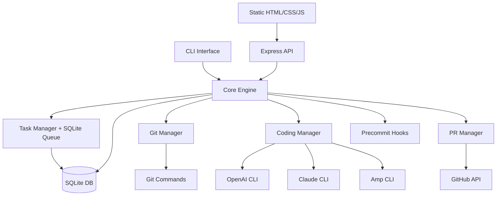
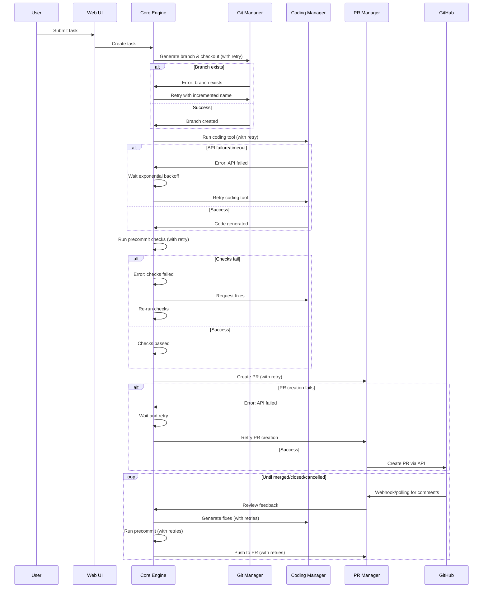
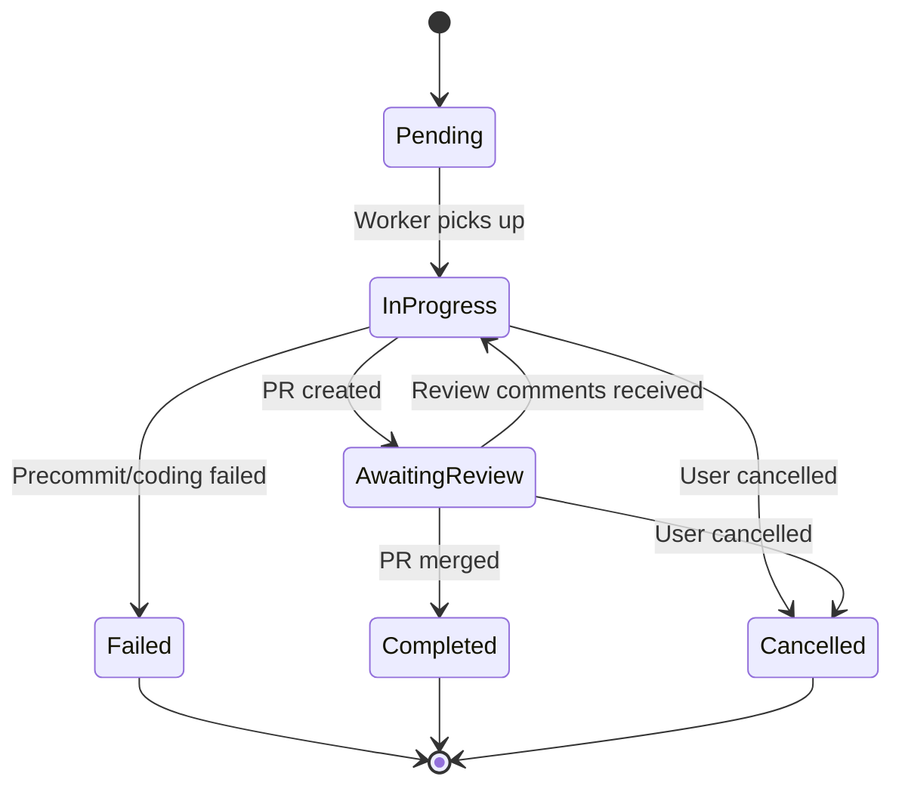

# Intern - Automated Coding Tool

## Overview
Intern is a tool that wraps CLI coding assistants (OpenAI Codex, Claude Code, Amp Code) to automate the entire development workflow from task assignment to PR merge with robust error handling and retry mechanisms.

## Architecture

### System Components



### Workflow Architecture with Resilience



## Technology Stack

### Core Technology Choices

| Component | Technology | Rationale |
|-----------|------------|-----------|
| **Language** | TypeScript | Type safety, familiar ecosystem, good CLI tooling |
| **Backend Framework** | Express.js | Lightweight, mature, extensive middleware ecosystem |
| **Database** | SQLite + better-sqlite3 | Local, zero-config, synchronous API |
| **Job Queue** | Custom SQLite-based queue | Simple polling system, no external dependencies |
| **CLI Framework** | Commander.js | Mature, feature-rich CLI builder |
| **Git Operations** | simple-git | Programmatic Git operations |
| **GitHub API** | Octokit | Official GitHub SDK |
| **Process Management** | execa | Better child process handling |
| **Configuration** | Zod + JSON files | Type-safe config validation |
| **Retry Logic** | Simple retry utilities | Built-in resilience patterns |

### Frontend Stack (Plain HTML/CSS/JS)
- **Static Files**: Vanilla HTML, CSS, JavaScript
- **Styling**: Tailwind CSS (imported from CDN)
- **HTTP Client**: Fetch API with retry logic
- **Real-time Updates**: Server-Sent Events (EventSource)
- **State Management**: Simple JS objects + localStorage
- **UI Updates**: DOM manipulation + CSS transitions

## Task Management System

### Job Queue Architecture
**Custom SQLite-based job queue** for local persistence and zero external dependencies:

```typescript
// Custom SQLite job queue implementation
import Database from 'better-sqlite3';

class SQLiteJobQueue {
  private db: Database.Database;
  
  constructor(dbPath: string) {
    this.db = new Database(dbPath);
    this.initTables();
  }
  
  private initTables() {
    this.db.exec(`
      CREATE TABLE IF NOT EXISTS jobs (
        id TEXT PRIMARY KEY,
        type TEXT NOT NULL,
        data TEXT NOT NULL,
        status TEXT DEFAULT 'pending',
        attempts INTEGER DEFAULT 0,
        max_attempts INTEGER DEFAULT 3,
        created_at DATETIME DEFAULT CURRENT_TIMESTAMP,
        scheduled_at DATETIME DEFAULT CURRENT_TIMESTAMP,
        processed_at DATETIME,
        failed_at DATETIME,
        error TEXT
      )
    `);
  }
  
  enqueue(type: string, data: any, options: { delay?: number, maxAttempts?: number } = {}) {
    const job = {
      id: generateId(),
      type,
      data: JSON.stringify(data),
      max_attempts: options.maxAttempts || 3,
      scheduled_at: options.delay ? 
        new Date(Date.now() + options.delay).toISOString() : 
        new Date().toISOString()
    };
    
    this.db.prepare(`
      INSERT INTO jobs (id, type, data, max_attempts, scheduled_at)
      VALUES (?, ?, ?, ?, ?)
    `).run(job.id, job.type, job.data, job.max_attempts, job.scheduled_at);
    
    return job.id;
  }
  
  // Worker polling mechanism
  process(type: string, handler: (data: any) => Promise<void>) {
    setInterval(async () => {
      const job = this.db.prepare(`
        SELECT * FROM jobs 
        WHERE type = ? AND status = 'pending' 
        AND scheduled_at <= datetime('now')
        AND attempts < max_attempts
        ORDER BY created_at ASC 
        LIMIT 1
      `).get(type);
      
      if (job) {
        await this.executeJob(job, handler);
      }
    }, 1000); // Poll every second
  }
  
  private async executeJob(job: any, handler: (data: any) => Promise<void>) {
    // Mark as processing
    this.db.prepare(`UPDATE jobs SET status = 'processing' WHERE id = ?`).run(job.id);
    
    try {
      await handler(JSON.parse(job.data));
      // Mark as completed
      this.db.prepare(`
        UPDATE jobs SET status = 'completed', processed_at = datetime('now') 
        WHERE id = ?
      `).run(job.id);
    } catch (error) {
      // Handle failure with retry logic
      const nextAttempt = job.attempts + 1;
      const backoffDelay = Math.pow(2, nextAttempt) * 1000; // Exponential backoff
      
      if (nextAttempt >= job.max_attempts) {
        // Max attempts reached
        this.db.prepare(`
          UPDATE jobs SET status = 'failed', failed_at = datetime('now'), 
          error = ?, attempts = ? WHERE id = ?
        `).run(error.message, nextAttempt, job.id);
      } else {
        // Schedule retry
        const retryAt = new Date(Date.now() + backoffDelay).toISOString();
        this.db.prepare(`
          UPDATE jobs SET status = 'pending', attempts = ?, 
          scheduled_at = ?, error = ? WHERE id = ?
        `).run(nextAttempt, retryAt, error.message, job.id);
      }
    }
  }
}
```

### Task States


## Data Storage

### SQLite Schema

```sql
-- Tasks table
CREATE TABLE tasks (
  id TEXT PRIMARY KEY,
  title TEXT NOT NULL,
  description TEXT NOT NULL,
  status TEXT NOT NULL, -- pending, in_progress, awaiting_review, completed, failed, cancelled
  coding_tool TEXT NOT NULL, -- openai, claude, amp
  branch_name TEXT,
  pr_number INTEGER,
  pr_url TEXT,
  created_at DATETIME DEFAULT CURRENT_TIMESTAMP,
  updated_at DATETIME DEFAULT CURRENT_TIMESTAMP,
  completed_at DATETIME
);

-- Task logs for debugging and history
CREATE TABLE task_logs (
  id INTEGER PRIMARY KEY AUTOINCREMENT,
  task_id TEXT NOT NULL,
  level TEXT NOT NULL, -- info, error, debug
  message TEXT NOT NULL,
  timestamp DATETIME DEFAULT CURRENT_TIMESTAMP,
  FOREIGN KEY (task_id) REFERENCES tasks(id)
);

-- Settings storage
CREATE TABLE settings (
  key TEXT PRIMARY KEY,
  value TEXT NOT NULL,
  category TEXT NOT NULL, -- api_keys, general, precommit, github
  updated_at DATETIME DEFAULT CURRENT_TIMESTAMP
);

-- Precommit checks configuration
CREATE TABLE precommit_checks (
  id INTEGER PRIMARY KEY AUTOINCREMENT,
  name TEXT NOT NULL,
  command TEXT NOT NULL,
  required BOOLEAN DEFAULT 1,
  enabled BOOLEAN DEFAULT 1,
  order_index INTEGER DEFAULT 0,
  created_at DATETIME DEFAULT CURRENT_TIMESTAMP
);

-- System configuration (onboarding status, etc.)
CREATE TABLE system_config (
  key TEXT PRIMARY KEY,
  value TEXT NOT NULL,
  updated_at DATETIME DEFAULT CURRENT_TIMESTAMP
);
```

### Configuration Management

**Location**: `~/.intern/`
```
~/.intern/
├── intern.db            # SQLite database (tasks + jobs + settings)
└── logs/                # Application logs
```

**Settings Storage Structure**:
```typescript
interface InternSettings {
  // API Keys (category: 'api_keys')
  github_token: string;
  openai_api_key?: string;
  claude_api_key?: string;
  amp_api_key?: string;
  
  // General settings (category: 'general')
  default_coding_tool: 'openai' | 'claude' | 'amp';
  branch_prefix: string; // e.g., 'intern/'
  pr_prefix: string;     // e.g., '[INTERN]'
  auto_merge: boolean;
  max_retries: number;
  
  // GitHub settings (category: 'github')
  github_repo_url: string;
  github_username: string; // Only respond to PR comments from this user
  poll_interval_seconds: number; // How often to poll for PR comments
}

interface PrecommitCheck {
  id: number;
  name: string;
  command: string;
  required: boolean;
  enabled: boolean;
  order_index: number;
}

interface SystemConfig {
  onboarding_completed: boolean;
  first_run: boolean;
  last_updated: string;
}
```

## Resilience & Error Handling

### Retry Utilities

```typescript
// Simple retry utilities
export async function withRetry<T>(
  operation: () => Promise<T>,
  context: string,
  maxRetries: number = 3
): Promise<T> {
  let lastError: Error;
  
  for (let attempt = 1; attempt <= maxRetries; attempt++) {
    try {
      return await operation();
    } catch (error) {
      lastError = error;
      console.log(`${context} failed (attempt ${attempt}/${maxRetries}):`, error.message);
      
      if (attempt === maxRetries) {
        throw new Error(`${context} failed after ${maxRetries} attempts: ${error.message}`);
      }
      
      // Exponential backoff with jitter
      const delay = 1000 * Math.pow(2, attempt - 1);
      const jitter = Math.random() * 0.1 * delay;
      await sleep(delay + jitter);
    }
  }
  
  throw lastError!;
}

function sleep(ms: number): Promise<void> {
  return new Promise(resolve => setTimeout(resolve, ms));
}
```

### Error Scenarios & Handling

| Scenario | Detection | Recovery Strategy |
|----------|-----------|-------------------|
| **Branch Already Exists** | Git error on checkout | Generate incremented branch name (task-1, task-2) |
| **OpenAI API Rate Limit** | HTTP 429 response | Exponential backoff, respect Retry-After header |
| **Claude API Timeout** | Request timeout | Retry with longer timeout, fallback to different model |
| **Amp Code Unavailable** | Command not found | Log error, suggest installation, mark task as failed |
| **Precommit Checks Fail** | Non-zero exit code | Request coding tool to fix issues, retry checks |
| **GitHub API Failure** | HTTP 5xx or network error | Retry with exponential backoff |
| **PR Already Exists** | GitHub API error | Update existing PR instead of creating new one |
| **Git Push Failure** | Authentication/network | Refresh tokens, retry push |
| **Webhook Missed** | No response in expected time | Fallback to polling GitHub API |
| **PR Comment Detection** | Poll PR for new comments | Only respond to comments from configured GitHub username |

## API Design

### Express.js API Routes

| Endpoint | Method | Purpose |
|----------|--------|---------|
| `/api/tasks` | GET | List all tasks |
| `/api/tasks` | POST | Create new task |
| `/api/tasks/:id` | GET | Get task details |
| `/api/tasks/:id` | PUT | Update task |
| `/api/tasks/:id` | DELETE | Cancel/delete task |
| `/api/tasks/:id/logs` | GET | Get task logs |
| `/api/tasks/:id/retry` | POST | Retry failed task |
| `/api/settings` | GET/PUT | Settings management |
| `/api/settings/onboarding` | GET | Check onboarding status |
| `/api/settings/onboarding` | POST | Complete onboarding setup |
| `/api/health` | GET | System health check |
| `/api/events` | GET | Server-Sent Events stream |

### CLI Commands

```bash
# Main commands
intern start              # Start the web server
intern task create        # Create new task (interactive)
intern task list          # List tasks
intern task cancel <id>   # Cancel task
intern status             # Show system status
intern config             # Configure settings
```

## Implementation Phases

### Phase 1: Core Infrastructure
- [ ] Project setup with Express.js + TypeScript
- [ ] SQLite database setup with better-sqlite3
- [ ] Custom job queue implementation
- [ ] Basic configuration management
- [ ] CLI framework setup

### Phase 2: Git & Coding Integration  
- [ ] Git operations (branch creation, checkout) with error handling
- [ ] Coding tool integrations (OpenAI, Claude, Amp) with retries
- [ ] Precommit hook system with failure recovery

### Phase 3: GitHub Integration
- [ ] PR creation and management with retry logic
- [ ] Webhook handling for PR events + polling fallback
- [ ] Comment parsing and feedback loop

### Phase 4: Web Interface (Plain HTML/CSS/JS)
- [ ] Static HTML task dashboard (OpenAI Codex style)
- [ ] Real-time status updates via Server-Sent Events
- [ ] Configuration management UI
- [ ] Logs viewer with filtering

### Phase 5: Polish & Reliability
- [ ] Comprehensive retry mechanisms
- [ ] Error recovery and graceful degradation
- [ ] Performance optimization and monitoring

## Technical Considerations

### Pros & Cons

#### Express.js + Plain Frontend Approach
**Pros:**
- Lightweight and focused
- Simple deployment (static files + API server)
- Easy to understand and debug
- Minimal dependencies
- Fast startup time

**Cons:**
- More manual work for frontend (no framework benefits)
- No built-in SSR or SEO benefits
- Manual state management required

#### SQLite Choice
**Pros:**
- Zero configuration
- Local file storage
- ACID compliance
- Good performance for local use
- Single file database

**Cons:**
- Single writer limitation (not an issue for local use)
- No built-in replication
- Manual backup required

#### Custom SQLite Job Queue
**Pros:**
- No external dependencies (Redis, etc.)
- Simple to understand and debug
- Persistent jobs stored locally
- Custom retry logic implementation
- Zero configuration

**Cons:**
- Less battle-tested than mature solutions
- Manual implementation of advanced features
- No clustering support (not needed for local use)
- Polling-based (higher latency than push-based)

### Device Failure Resilience

The system is designed to recover from device failures:

1. **Persistent Job Queue**: Jobs are stored in SQLite and survive server restarts
2. **Task State Recovery**: On startup, the system picks up in-progress tasks
3. **Partial Work Tracking**: Git branches and PRs are preserved across restarts
4. **Graceful Degradation**: Failed tasks can be retried manually or automatically

### Startup Recovery Process

```typescript
// On server startup
class StartupRecovery {
  async recoverTasks() {
    // Find tasks that were in progress when server stopped
    const incompleteTasks = db.prepare(`
      SELECT * FROM tasks 
      WHERE status IN ('in_progress', 'pending')
      ORDER BY created_at ASC
    `).all();
    
    for (const task of incompleteTasks) {
      // Check if git branch still exists
      if (await this.branchExists(task.branch_name)) {
        // Enqueue for continuation
        jobQueue.enqueue('continue-task', { taskId: task.id });
      } else {
        // Mark as failed - branch was deleted
        this.markTaskFailed(task.id, 'Branch no longer exists');
      }
    }
  }
}
```

### Security Considerations

1. **API Keys**: Store in `~/.intern/configs.json` with proper file permissions (600)
2. **GitHub Webhooks**: Use HMAC signature verification
3. **Process Isolation**: Run coding tools in sandboxed environments
4. **Input Validation**: Sanitize all user inputs and git operations

### Performance Considerations

1. **Polling vs Webhooks**: Use webhooks for PR events when possible
2. **Database Indexing**: Index frequently queried columns
3. **Log Rotation**: Implement log rotation to prevent disk space issues
4. **Memory Management**: Stream large outputs instead of loading in memory

## Configuration Examples

### Database Settings Example

```sql
-- API Keys
INSERT INTO settings (key, value, category) VALUES 
('github_token', 'ghp_xxxx', 'api_keys'),
('openai_api_key', 'sk-xxxx', 'api_keys'),
('claude_api_key', 'claude_xxxx', 'api_keys'),
('amp_api_key', 'amp_xxxx', 'api_keys');

-- General Settings
INSERT INTO settings (key, value, category) VALUES 
('default_coding_tool', 'amp', 'general'),
('branch_prefix', 'intern/', 'general'),
('pr_prefix', '[INTERN] ', 'general'),
('auto_merge', 'false', 'general'),
('max_retries', '3', 'general');

-- GitHub Settings
INSERT INTO settings (key, value, category) VALUES 
('github_username', 'user', 'github'),
('poll_interval_seconds', '30', 'github');

-- System Config
INSERT INTO system_config (key, value) VALUES 
('onboarding_completed', 'true'),
('first_run', 'false');
```

## Next Steps

1. **Prototype Development**: Start with basic task creation and git operations
2. **Tool Integration**: Begin with one coding tool (Amp) for initial testing
3. **Feedback Loop**: Test the basic workflow end-to-end
4. **Iteration**: Add features based on real usage patterns

## Frontend Design (OpenAI Codex Style)

### Task Dashboard Layout

```html
# Required
GITHUB_TOKEN=ghp_xxxx
OPENAI_API_KEY=sk-xxxx

# Optional
CLAUDE_API_KEY=claude_xxxx
AMP_API_KEY=amp_xxxx
```

## Next Steps

1. **Prototype Development**: Start with basic task creation and git operations
2. **Tool Integration**: Begin with one coding tool (Amp) for initial testing
3. **Feedback Loop**: Test the basic workflow end-to-end
4. **Iteration**: Add features based on real usage patterns

## Frontend Design (OpenAI Codex Style)

### Application Structure

**Single Page Application** with multiple views managed via JavaScript routing:

```
/                    # Task Dashboard (default)
/onboarding         # Initial setup (shown if not configured)
/task/new           # Create New Task
/task/:id           # Task Detail View
/task/:id/logs      # Task Logs Viewer
/settings           # Settings & Configuration
```

### 1. Onboarding Page (`/onboarding`)

```html
<div class="min-h-screen bg-gradient-to-br from-blue-50 to-indigo-100 flex items-center justify-center py-12 px-4">
  <div class="max-w-2xl w-full">
    <div class="text-center mb-8">
      <h1 class="text-4xl font-bold text-gray-900 mb-4">Welcome to Intern</h1>
      <p class="text-xl text-gray-600">Let's get you set up with automated code review</p>
    </div>

    <div class="bg-white rounded-lg shadow-lg p-8">
      <!-- Progress Steps -->
      <div class="mb-8">
        <div class="flex items-center justify-between mb-4">
          <div class="step active" data-step="1">
            <div class="step-circle">1</div>
            <span class="step-label">API Keys</span>
          </div>
          <div class="step-line"></div>
          <div class="step" data-step="2">
            <div class="step-circle">2</div>
            <span class="step-label">GitHub</span>
          </div>
          <div class="step-line"></div>
          <div class="step" data-step="3">
            <div class="step-circle">3</div>
            <span class="step-label">Preferences</span>
          </div>
        </div>
        <div class="progress-bar">
          <div class="progress-fill" style="width: 33%"></div>
        </div>
      </div>

      <!-- Step 1: API Keys -->
      <div id="step-1" class="step-content active">
        <h2 class="text-2xl font-semibold text-gray-900 mb-4">Configure API Keys</h2>
        <p class="text-gray-600 mb-6">Add your API keys to enable coding assistants</p>
        
        <div class="space-y-4">
          <div>
            <label for="github-token" class="block text-sm font-medium text-gray-700 mb-2">
              GitHub Token * <span class="text-xs text-gray-500">(Required for PR management)</span>
            </label>
            <input type="password" id="github-token" required
                   class="w-full px-3 py-2 border border-gray-300 rounded-md focus:outline-none focus:ring-2 focus:ring-blue-500"
                   placeholder="ghp_xxxxxxxxxxxx">
            <p class="text-xs text-gray-500 mt-1">
              <a href="https://github.com/settings/personal-access-tokens" target="_blank" class="text-blue-600 hover:text-blue-800">
                Generate a GitHub token →
              </a>
            </p>
          </div>

          <div>
            <label for="coding-tool-choice" class="block text-sm font-medium text-gray-700 mb-2">
              Choose a coding assistant *
            </label>
            <select id="coding-tool-choice" required
                    class="w-full px-3 py-2 border border-gray-300 rounded-md focus:outline-none focus:ring-2 focus:ring-blue-500">
              <option value="">Select a tool...</option>
              <option value="amp">Amp</option>
              <option value="openai">OpenAI Codex</option>
              <option value="claude">Claude Code</option>
            </select>
          </div>

          <div id="api-key-input" class="hidden">
            <label for="selected-api-key" class="block text-sm font-medium text-gray-700 mb-2">
              API Key *
            </label>
            <input type="password" id="selected-api-key" 
                   class="w-full px-3 py-2 border border-gray-300 rounded-md focus:outline-none focus:ring-2 focus:ring-blue-500"
                   placeholder="">
          </div>
        </div>
      </div>

      <!-- Step 2: GitHub Configuration -->
      <div id="step-2" class="step-content hidden">
        <h2 class="text-2xl font-semibold text-gray-900 mb-4">GitHub Configuration</h2>
        <p class="text-gray-600 mb-6">Configure your GitHub repository and user settings</p>
        
        <div class="space-y-4">
          <div>
            <label for="github-repo" class="block text-sm font-medium text-gray-700 mb-2">
              Repository URL *
            </label>
            <input type="url" id="github-repo" required
                   class="w-full px-3 py-2 border border-gray-300 rounded-md focus:outline-none focus:ring-2 focus:ring-blue-500"
                   placeholder="https://github.com/username/repository">
          </div>

          <div>
            <label for="github-username" class="block text-sm font-medium text-gray-700 mb-2">
              Your GitHub Username *
            </label>
            <input type="text" id="github-username" required
                   class="w-full px-3 py-2 border border-gray-300 rounded-md focus:outline-none focus:ring-2 focus:ring-blue-500"
                   placeholder="username">
            <p class="text-xs text-gray-500 mt-1">Intern will only respond to PR comments from this user</p>
          </div>

          <div>
            <label for="poll-interval" class="block text-sm font-medium text-gray-700 mb-2">
              PR Comment Polling Interval (seconds)
            </label>
            <input type="number" id="poll-interval" value="30" min="10" max="300"
                   class="w-full px-3 py-2 border border-gray-300 rounded-md focus:outline-none focus:ring-2 focus:ring-blue-500">
          </div>
        </div>
      </div>

      <!-- Step 3: Preferences -->
      <div id="step-3" class="step-content hidden">
        <h2 class="text-2xl font-semibold text-gray-900 mb-4">Preferences</h2>
        <p class="text-gray-600 mb-6">Customize Intern's behavior</p>
        
        <div class="space-y-4">
          <div>
            <label for="branch-prefix" class="block text-sm font-medium text-gray-700 mb-2">
              Branch Prefix
            </label>
            <input type="text" id="branch-prefix" value="intern/"
                   class="w-full px-3 py-2 border border-gray-300 rounded-md focus:outline-none focus:ring-2 focus:ring-blue-500"
                   placeholder="intern/">
          </div>

          <div>
            <label for="pr-prefix" class="block text-sm font-medium text-gray-700 mb-2">
              PR Title Prefix
            </label>
            <input type="text" id="pr-prefix" value="[INTERN]"
                   class="w-full px-3 py-2 border border-gray-300 rounded-md focus:outline-none focus:ring-2 focus:ring-blue-500"
                   placeholder="[INTERN]">
          </div>

          <div>
            <label for="max-retries" class="block text-sm font-medium text-gray-700 mb-2">
              Maximum Retries
            </label>
            <input type="number" id="max-retries" value="3" min="1" max="10"
                   class="w-full px-3 py-2 border border-gray-300 rounded-md focus:outline-none focus:ring-2 focus:ring-blue-500">
          </div>

          <div class="flex items-center">
            <input type="checkbox" id="auto-merge" class="mr-2">
            <label for="auto-merge" class="text-sm text-gray-700">
              Auto-merge PRs when all checks pass
            </label>
          </div>
        </div>
      </div>

      <!-- Navigation -->
      <div class="flex justify-between mt-8 pt-6 border-t border-gray-200">
        <button id="prev-btn" class="px-6 py-2 text-gray-600 bg-gray-100 rounded-md hover:bg-gray-200 disabled:opacity-50" disabled>
          Previous
        </button>
        <button id="next-btn" class="px-6 py-2 bg-blue-600 text-white rounded-md hover:bg-blue-700">
          Next
        </button>
        <button id="finish-btn" class="px-6 py-2 bg-green-600 text-white rounded-md hover:bg-green-700 hidden">
          Complete Setup
        </button>
      </div>
    </div>
  </div>
</div>

<style>
.step {
  display: flex;
  flex-direction: column;
  align-items: center;
  flex: 1;
}

.step-circle {
  width: 32px;
  height: 32px;
  border-radius: 50%;
  display: flex;
  align-items: center;
  justify-content: center;
  background-color: #e5e7eb;
  color: #6b7280;
  font-weight: 600;
  margin-bottom: 8px;
}

.step.active .step-circle {
  background-color: #3b82f6;
  color: white;
}

.step.completed .step-circle {
  background-color: #10b981;
  color: white;
}

.step-label {
  font-size: 14px;
  color: #6b7280;
}

.step.active .step-label {
  color: #3b82f6;
  font-weight: 600;
}

.step-line {
  flex: 1;
  height: 2px;
  background-color: #e5e7eb;
  margin: 16px 16px 24px 16px;
}

.progress-bar {
  width: 100%;
  height: 4px;
  background-color: #e5e7eb;
  border-radius: 2px;
  overflow: hidden;
}

.progress-fill {
  height: 100%;
  background-color: #3b82f6;
  transition: width 0.3s ease;
}

.step-content {
  min-height: 300px;
}

.step-content.hidden {
  display: none;
}
</style>
```

### 2. Task Dashboard Layout (`/`)

```html
<!DOCTYPE html>
<html lang="en">
<head>
  <meta charset="UTF-8">
  <meta name="viewport" content="width=device-width, initial-scale=1.0">
  <title>Intern - Code Review Tasks</title>
  <script src="https://cdn.tailwindcss.com"></script>
  <link rel="stylesheet" href="/styles/app.css">
</head>
<body class="bg-gray-50">
  <!-- Navigation Header -->
  <nav class="bg-white shadow-sm border-b">
    <div class="max-w-7xl mx-auto px-4 sm:px-6 lg:px-8">
      <div class="flex justify-between items-center h-16">
        <div class="flex items-center">
          <h1 class="text-xl font-semibold text-gray-900">Intern</h1>
        </div>
        <div class="flex items-center space-x-4">
          <button id="new-task-btn" class="bg-blue-600 text-white px-4 py-2 rounded-md hover:bg-blue-700">
            New Task
          </button>
          <a href="/settings" class="text-gray-500 hover:text-gray-700">
            <svg class="w-5 h-5" fill="currentColor" viewBox="0 0 20 20">
              <path fill-rule="evenodd" d="M11.49 3.17c-.38-1.56-2.6-1.56-2.98 0a1.532 1.532 0 01-2.286.948c-1.372-.836-2.942.734-2.106 2.106.54.886.061 2.042-.947 2.287-1.561.379-1.561 2.6 0 2.978a1.532 1.532 0 01.947 2.287c-.836 1.372.734 2.942 2.106 2.106a1.532 1.532 0 012.287.947c.379 1.561 2.6 1.561 2.978 0a1.533 1.533 0 012.287-.947c1.372.836 2.942-.734 2.106-2.106a1.533 1.533 0 01.947-2.287c1.561-.379 1.561-2.6 0-2.978a1.532 1.532 0 01-.947-2.287c.836-1.372-.734-2.942-2.106-2.106a1.532 1.532 0 01-2.287-.947zM10 13a3 3 0 100-6 3 3 0 000 6z" clip-rule="evenodd"></path>
            </svg>
          </a>
        </div>
      </div>
    </div>
  </nav>

  <!-- Main Content -->
  <main class="max-w-7xl mx-auto py-6 px-4 sm:px-6 lg:px-8">
    <!-- Filters & Search -->
    <div class="mb-6 flex flex-col sm:flex-row sm:items-center sm:justify-between">
      <div class="flex space-x-2 mb-4 sm:mb-0">
        <button class="filter-btn active" data-status="all">All</button>
        <button class="filter-btn" data-status="pending">Pending</button>
        <button class="filter-btn" data-status="in-progress">In Progress</button>
        <button class="filter-btn" data-status="awaiting-review">Awaiting Review</button>
        <button class="filter-btn" data-status="completed">Completed</button>
        <button class="filter-btn" data-status="failed">Failed</button>
      </div>
      
      <div class="flex items-center space-x-4">
        <input type="text" id="search-input" placeholder="Search tasks..." 
               class="px-3 py-2 border border-gray-300 rounded-md focus:outline-none focus:ring-2 focus:ring-blue-500">
        <select id="sort-select" class="px-3 py-2 border border-gray-300 rounded-md">
          <option value="created_desc">Newest First</option>
          <option value="created_asc">Oldest First</option>
          <option value="updated_desc">Recently Updated</option>
          <option value="title_asc">Title A-Z</option>
        </select>
      </div>
    </div>

    <!-- Task List -->
    <div id="task-list" class="space-y-4">
      <!-- Tasks populated via JavaScript -->
    </div>

    <!-- Pagination -->
    <div id="pagination" class="mt-8 flex items-center justify-between">
      <div class="text-sm text-gray-700">
        Showing <span id="showing-start">1</span> to <span id="showing-end">10</span> of <span id="total-count">42</span> tasks
      </div>
      <div class="flex space-x-1">
        <button id="prev-page" class="px-3 py-2 border border-gray-300 rounded-md hover:bg-gray-50 disabled:opacity-50">
          Previous
        </button>
        <div id="page-numbers" class="flex space-x-1">
          <!-- Page numbers populated via JavaScript -->
        </div>
        <button id="next-page" class="px-3 py-2 border border-gray-300 rounded-md hover:bg-gray-50 disabled:opacity-50">
          Next
        </button>
      </div>
    </div>
  </main>

  <script src="/js/dashboard.js"></script>
</body>
</html>
```

### Task Card Component

```html
<div class="bg-white rounded-lg shadow-sm border border-gray-200 p-6 hover:shadow-md transition-shadow cursor-pointer" 
     data-task-id="task-123" onclick="viewTask('task-123')">
  <!-- Header -->
  <div class="flex items-start justify-between mb-4">
    <div class="flex-1">
      <h3 class="text-lg font-medium text-gray-900 mb-1">Implement user authentication</h3>
      <p class="text-sm text-gray-600 line-clamp-2">Add JWT-based authentication system with login, signup, and password reset functionality</p>
    </div>
    <div class="flex items-center space-x-2 ml-4">
      <span class="status-badge status-in-progress">In Progress</span>
      <div class="relative">
        <button class="text-gray-400 hover:text-gray-600" onclick="toggleTaskMenu(event, 'task-123')">
          <svg class="w-5 h-5" fill="currentColor" viewBox="0 0 20 20">
            <path d="M10 6a2 2 0 110-4 2 2 0 010 4zM10 12a2 2 0 110-4 2 2 0 010 4zM10 18a2 2 0 110-4 2 2 0 010 4z"></path>
          </svg>
        </button>
      </div>
    </div>
  </div>

  <!-- Metadata Grid -->
  <div class="grid grid-cols-2 md:grid-cols-4 gap-4 mb-4 text-sm">
    <div>
      <span class="text-gray-500">Agent:</span>
      <span class="ml-1 font-medium">Amp</span>
    </div>
    <div>
      <span class="text-gray-500">Branch:</span>
      <span class="ml-1 font-mono text-xs">intern/auth-1</span>
    </div>
    <div>
      <span class="text-gray-500">PR:</span>
      <a href="https://github.com/user/repo/pull/42" class="ml-1 text-blue-600 hover:text-blue-800" onclick="event.stopPropagation()">
        #42
      </a>
    </div>
    <div>
      <span class="text-gray-500">Started:</span>
      <span class="ml-1">2h ago</span>
    </div>
  </div>

  <!-- Progress Bar -->
  <div class="mb-4">
    <div class="flex items-center justify-between text-sm mb-2">
      <span class="text-gray-600">Running precommit checks...</span>
      <span class="text-gray-500">60%</span>
    </div>
    <div class="w-full bg-gray-200 rounded-full h-2">
      <div class="bg-blue-600 h-2 rounded-full transition-all duration-300" style="width: 60%"></div>
    </div>
  </div>

  <!-- Actions -->
  <div class="flex items-center justify-between pt-2 border-t border-gray-100">
    <div class="flex items-center space-x-4 text-sm text-gray-500">
      <span>Updated 5 min ago</span>
      <span>•</span>
      <span>3 attempts</span>
    </div>
    <div class="flex items-center space-x-2">
      <button class="text-blue-600 hover:text-blue-800 text-sm font-medium" onclick="viewLogs(event, 'task-123')">
        View Logs
      </button>
      <button class="text-red-600 hover:text-red-800 text-sm font-medium" onclick="cancelTask(event, 'task-123')">
        Cancel
      </button>
    </div>
  </div>
</div>
```

### 2. New Task Creation (`/task/new`)

```html
<div class="max-w-2xl mx-auto py-8 px-4">
  <div class="bg-white rounded-lg shadow-sm border border-gray-200 p-8">
    <div class="mb-6">
      <h2 class="text-2xl font-bold text-gray-900 mb-2">Create New Task</h2>
      <p class="text-gray-600">Describe what you want the coding assistant to implement</p>
    </div>

    <form id="new-task-form" class="space-y-6">
      <!-- Task Title -->
      <div>
        <label for="task-title" class="block text-sm font-medium text-gray-700 mb-2">
          Task Title *
        </label>
        <input type="text" id="task-title" name="title" required
               class="w-full px-3 py-2 border border-gray-300 rounded-md focus:outline-none focus:ring-2 focus:ring-blue-500"
               placeholder="e.g., Implement user authentication">
      </div>

      <!-- Task Description -->
      <div>
        <label for="task-description" class="block text-sm font-medium text-gray-700 mb-2">
          Description *
        </label>
        <textarea id="task-description" name="description" rows="6" required
                  class="w-full px-3 py-2 border border-gray-300 rounded-md focus:outline-none focus:ring-2 focus:ring-blue-500"
                  placeholder="Provide detailed requirements, acceptance criteria, and any specific implementation notes..."></textarea>
        <p class="text-sm text-gray-500 mt-1">Be specific about what you want implemented. Include examples, edge cases, and requirements.</p>
      </div>

      <!-- Coding Tool Selection -->
      <div>
        <label for="coding-tool" class="block text-sm font-medium text-gray-700 mb-2">
          Coding Assistant
        </label>
        <select id="coding-tool" name="codingTool" 
                class="w-full px-3 py-2 border border-gray-300 rounded-md focus:outline-none focus:ring-2 focus:ring-blue-500">
          <option value="amp">Amp (Default)</option>
          <option value="openai">OpenAI Codex</option>
          <option value="claude">Claude Code</option>
        </select>
      </div>

      <!-- Advanced Options (Collapsible) -->
      <div class="border-t border-gray-200 pt-6">
        <button type="button" id="toggle-advanced" class="flex items-center text-sm font-medium text-gray-700 hover:text-gray-900">
          <svg class="w-4 h-4 mr-2 transform transition-transform" id="advanced-arrow">
            <path fill="currentColor" d="M7.41 8.84L12 13.42 16.59 8.84 18 10.25l-6 6-6-6z"/>
          </svg>
          Advanced Options
        </button>
        
        <div id="advanced-options" class="hidden mt-4 space-y-4 pl-6">
          <div>
            <label for="branch-prefix" class="block text-sm font-medium text-gray-700 mb-2">
              Branch Prefix
            </label>
            <input type="text" id="branch-prefix" name="branchPrefix" 
                   class="w-full px-3 py-2 border border-gray-300 rounded-md"
                   placeholder="intern/" value="intern/">
          </div>
          
          <div>
            <label for="pr-prefix" class="block text-sm font-medium text-gray-700 mb-2">
              PR Title Prefix
            </label>
            <input type="text" id="pr-prefix" name="prPrefix"
                   class="w-full px-3 py-2 border border-gray-300 rounded-md"
                   placeholder="[INTERN]" value="[INTERN]">
          </div>

          <div class="flex items-center">
            <input type="checkbox" id="auto-merge" name="autoMerge" class="mr-2">
            <label for="auto-merge" class="text-sm text-gray-700">
              Auto-merge PR when all checks pass (requires admin privileges)
            </label>
          </div>
        </div>
      </div>

      <!-- Actions -->
      <div class="flex items-center justify-between pt-6 border-t border-gray-200">
        <button type="button" onclick="history.back()" 
                class="px-4 py-2 text-gray-700 bg-gray-100 rounded-md hover:bg-gray-200">
          Cancel
        </button>
        <button type="submit" 
                class="px-6 py-2 bg-blue-600 text-white rounded-md hover:bg-blue-700 disabled:opacity-50">
          Create Task
        </button>
      </div>
    </form>
  </div>
</div>
```

### 3. Task Detail View (`/task/:id`)

```html
<div class="max-w-4xl mx-auto py-8 px-4">
  <!-- Header -->
  <div class="mb-8">
    <nav class="flex items-center space-x-2 text-sm text-gray-500 mb-4">
      <a href="/" class="hover:text-gray-700">Tasks</a>
      <span>/</span>
      <span class="text-gray-900">Task Details</span>
    </nav>
    
    <div class="flex items-start justify-between">
      <div class="flex-1">
        <h1 class="text-3xl font-bold text-gray-900 mb-2">Implement user authentication</h1>
        <div class="flex items-center space-x-4 text-sm text-gray-500">
          <span>Created 3 hours ago</span>
          <span>•</span>
          <span>Last updated 2 minutes ago</span>
          <span>•</span>
          <span>Task ID: task-123</span>
        </div>
      </div>
      <div class="flex items-center space-x-3">
        <span class="status-badge status-in-progress">In Progress</span>
        <button class="text-red-600 hover:text-red-800 font-medium" onclick="cancelTask('task-123')">
          Cancel Task
        </button>
      </div>
    </div>
  </div>

  <!-- Content Grid -->
  <div class="grid grid-cols-1 lg:grid-cols-3 gap-8">
    <!-- Main Content -->
    <div class="lg:col-span-2 space-y-6">
      <!-- Description -->
      <div class="bg-white rounded-lg shadow-sm border border-gray-200 p-6">
        <h2 class="text-lg font-medium text-gray-900 mb-4">Description</h2>
        <div class="prose prose-sm max-w-none text-gray-700">
          <p>Add JWT-based authentication system with login, signup, and password reset functionality. The system should include:</p>
          <ul>
            <li>User registration with email verification</li>
            <li>Login with email/password</li>
            <li>JWT token management</li>
            <li>Password reset flow</li>
            <li>Protected route middleware</li>
          </ul>
        </div>
      </div>

      <!-- Progress Timeline -->
      <div class="bg-white rounded-lg shadow-sm border border-gray-200 p-6">
        <div class="flex items-center justify-between mb-4">
          <h2 class="text-lg font-medium text-gray-900">Progress</h2>
          <a href="/task/task-123/logs" class="text-blue-600 hover:text-blue-800 text-sm font-medium">
            View Full Logs →
          </a>
        </div>
        
        <div class="space-y-4">
          <div class="flex items-start space-x-3">
            <div class="flex-shrink-0 w-2 h-2 bg-green-500 rounded-full mt-2"></div>
            <div class="flex-1">
              <p class="text-sm font-medium text-gray-900">Task created</p>
              <p class="text-xs text-gray-500">3 hours ago</p>
            </div>
          </div>
          
          <div class="flex items-start space-x-3">
            <div class="flex-shrink-0 w-2 h-2 bg-green-500 rounded-full mt-2"></div>
            <div class="flex-1">
              <p class="text-sm font-medium text-gray-900">Branch created: intern/auth-1</p>
              <p class="text-xs text-gray-500">3 hours ago</p>
            </div>
          </div>
          
          <div class="flex items-start space-x-3">
            <div class="flex-shrink-0 w-2 h-2 bg-green-500 rounded-full mt-2"></div>
            <div class="flex-1">
              <p class="text-sm font-medium text-gray-900">Amp generated initial implementation</p>
              <p class="text-xs text-gray-500">2 hours ago</p>
            </div>
          </div>
          
          <div class="flex items-start space-x-3">
            <div class="flex-shrink-0 w-2 h-2 bg-blue-500 rounded-full mt-2 animate-pulse"></div>
            <div class="flex-1">
              <p class="text-sm font-medium text-gray-900">Running precommit checks</p>
              <p class="text-xs text-gray-500">In progress...</p>
              <div class="w-full bg-gray-200 rounded-full h-1.5 mt-2">
                <div class="bg-blue-600 h-1.5 rounded-full" style="width: 60%"></div>
              </div>
            </div>
          </div>
        </div>
      </div>

      <!-- Files Changed -->
      <div class="bg-white rounded-lg shadow-sm border border-gray-200 p-6">
        <h2 class="text-lg font-medium text-gray-900 mb-4">Files Changed</h2>
        <div class="space-y-2 text-sm">
          <div class="flex items-center space-x-2">
            <span class="text-green-600">+</span>
            <span class="font-mono">src/auth/auth.controller.ts</span>
            <span class="text-gray-500">+45 lines</span>
          </div>
          <div class="flex items-center space-x-2">
            <span class="text-green-600">+</span>
            <span class="font-mono">src/auth/auth.service.ts</span>
            <span class="text-gray-500">+78 lines</span>
          </div>
          <div class="flex items-center space-x-2">
            <span class="text-blue-600">M</span>
            <span class="font-mono">src/app.module.ts</span>
            <span class="text-gray-500">+3 -1 lines</span>
          </div>
        </div>
      </div>
    </div>

    <!-- Sidebar -->
    <div class="space-y-6">
      <!-- Metadata -->
      <div class="bg-white rounded-lg shadow-sm border border-gray-200 p-6">
        <h3 class="text-sm font-medium text-gray-900 mb-4">Details</h3>
        <div class="space-y-3 text-sm">
          <div class="flex justify-between">
            <span class="text-gray-500">Coding Agent:</span>
            <span class="font-medium">Amp</span>
          </div>
          <div class="flex justify-between">
            <span class="text-gray-500">Branch:</span>
            <span class="font-mono text-xs">intern/auth-1</span>
          </div>
          <div class="flex justify-between">
            <span class="text-gray-500">Pull Request:</span>
            <a href="#" class="text-blue-600 hover:text-blue-800">#42</a>
          </div>
          <div class="flex justify-between">
            <span class="text-gray-500">Attempts:</span>
            <span>3 / 5</span>
          </div>
        </div>
      </div>

      <!-- Actions -->
      <div class="bg-white rounded-lg shadow-sm border border-gray-200 p-6">
        <h3 class="text-sm font-medium text-gray-900 mb-4">Actions</h3>
        <div class="space-y-3">
          <button class="w-full text-left px-3 py-2 text-sm text-gray-700 hover:bg-gray-50 rounded">
            Retry Task
          </button>
          <button class="w-full text-left px-3 py-2 text-sm text-gray-700 hover:bg-gray-50 rounded">
            View Git Diff
          </button>
          <button class="w-full text-left px-3 py-2 text-sm text-gray-700 hover:bg-gray-50 rounded">
            Open in GitHub
          </button>
          <button class="w-full text-left px-3 py-2 text-sm text-red-600 hover:bg-red-50 rounded">
            Cancel Task
          </button>
        </div>
      </div>
    </div>
  </div>
</div>
```

### 4. Logs Viewer (`/task/:id/logs`)

```html
<div class="max-w-6xl mx-auto py-8 px-4">
  <!-- Header -->
  <div class="mb-8">
    <nav class="flex items-center space-x-2 text-sm text-gray-500 mb-4">
      <a href="/" class="hover:text-gray-700">Tasks</a>
      <span>/</span>
      <a href="/task/task-123" class="hover:text-gray-700">Task Details</a>
      <span>/</span>
      <span class="text-gray-900">Logs</span>
    </nav>
    
    <div class="flex items-center justify-between">
      <h1 class="text-2xl font-bold text-gray-900">Task Logs</h1>
      <div class="flex items-center space-x-3">
        <button id="auto-scroll-btn" class="px-3 py-1 text-sm border border-gray-300 rounded-md hover:bg-gray-50">
          Auto-scroll: On
        </button>
        <button id="clear-logs-btn" class="px-3 py-1 text-sm text-red-600 border border-red-300 rounded-md hover:bg-red-50">
          Clear
        </button>
      </div>
    </div>
  </div>

  <!-- Filters -->
  <div class="mb-6 flex items-center space-x-4">
    <div class="flex items-center space-x-2">
      <span class="text-sm font-medium text-gray-700">Level:</span>
      <select id="log-level-filter" class="px-2 py-1 text-sm border border-gray-300 rounded">
        <option value="all">All</option>
        <option value="info">Info</option>
        <option value="error">Error</option>
        <option value="debug">Debug</option>
      </select>
    </div>
    
    <div class="flex items-center space-x-2">
      <span class="text-sm font-medium text-gray-700">Search:</span>
      <input type="text" id="log-search" placeholder="Search logs..." 
             class="px-2 py-1 text-sm border border-gray-300 rounded-md">
    </div>
    
    <div class="flex items-center space-x-2">
      <span class="text-sm font-medium text-gray-700">Time Range:</span>
      <select id="time-range-filter" class="px-2 py-1 text-sm border border-gray-300 rounded">
        <option value="all">All Time</option>
        <option value="1h">Last Hour</option>
        <option value="6h">Last 6 Hours</option>
        <option value="24h">Last 24 Hours</option>
      </select>
    </div>
  </div>

  <!-- Log Console -->
  <div class="bg-gray-900 rounded-lg overflow-hidden">
    <div class="flex items-center justify-between px-4 py-2 bg-gray-800 border-b border-gray-700">
      <div class="flex items-center space-x-2">
        <div class="w-3 h-3 bg-red-500 rounded-full"></div>
        <div class="w-3 h-3 bg-yellow-500 rounded-full"></div>
        <div class="w-3 h-3 bg-green-500 rounded-full"></div>
        <span class="ml-4 text-sm text-gray-300">Task: task-123</span>
      </div>
      <div class="text-sm text-gray-400">
        <span id="log-count">247 entries</span>
        <span class="mx-2">•</span>
        <span id="last-updated">Updated 2s ago</span>
      </div>
    </div>
    
    <div id="log-container" class="h-96 overflow-y-auto p-4 font-mono text-sm">
      <!-- Log entries populated via JavaScript -->
      <div class="log-entry" data-level="info" data-timestamp="2024-01-15T10:30:00Z">
        <span class="text-gray-500">[10:30:00]</span>
        <span class="text-blue-400">[INFO]</span>
        <span class="text-green-400">[GitManager]</span>
        <span class="text-gray-100">Creating branch: intern/auth-1</span>
      </div>
      
      <div class="log-entry" data-level="info" data-timestamp="2024-01-15T10:30:02Z">
        <span class="text-gray-500">[10:30:02]</span>
        <span class="text-blue-400">[INFO]</span>
        <span class="text-purple-400">[CodingManager]</span>
        <span class="text-gray-100">Calling Amp API with prompt...</span>
      </div>
      
      <div class="log-entry" data-level="debug" data-timestamp="2024-01-15T10:30:15Z">
        <span class="text-gray-500">[10:30:15]</span>
        <span class="text-gray-400">[DEBUG]</span>
        <span class="text-purple-400">[CodingManager]</span>
        <span class="text-gray-300">API Response received: 2.1KB</span>
      </div>
      
      <div class="log-entry" data-level="error" data-timestamp="2024-01-15T10:32:00Z">
        <span class="text-gray-500">[10:32:00]</span>
        <span class="text-red-400">[ERROR]</span>
        <span class="text-yellow-400">[PrecommitManager]</span>
        <span class="text-gray-100">TypeScript check failed:</span>
        <div class="ml-8 text-red-300 whitespace-pre-wrap">src/auth/auth.service.ts:45:12 - error TS2304: Cannot find name 'jwt'.</div>
      </div>
    </div>
  </div>
</div>
```

### 5. Settings Page (`/settings`)

```html
<div class="max-w-4xl mx-auto py-8 px-4">
  <div class="mb-8">
    <h1 class="text-3xl font-bold text-gray-900 mb-2">Settings</h1>
    <p class="text-gray-600">Configure Intern's behavior and integrations</p>
  </div>

  <div class="space-y-8">
    <!-- API Keys Section -->
    <div class="bg-white rounded-lg shadow-sm border border-gray-200 p-6">
      <h2 class="text-xl font-semibold text-gray-900 mb-4">API Keys</h2>
      <div class="space-y-4">
        <div>
          <label for="github-token" class="block text-sm font-medium text-gray-700 mb-2">
            GitHub Token *
          </label>
          <div class="flex space-x-2">
            <input type="password" id="github-token" 
                   class="flex-1 px-3 py-2 border border-gray-300 rounded-md"
                   placeholder="ghp_xxxxxxxxxxxx" value="••••••••••••••••">
            <button class="px-3 py-2 text-sm border border-gray-300 rounded-md hover:bg-gray-50">
              Test
            </button>
          </div>
          <p class="text-xs text-gray-500 mt-1">Required for creating PRs and managing repositories</p>
        </div>

        <div>
          <label for="openai-key" class="block text-sm font-medium text-gray-700 mb-2">
            OpenAI API Key
          </label>
          <div class="flex space-x-2">
            <input type="password" id="openai-key" 
                   class="flex-1 px-3 py-2 border border-gray-300 rounded-md"
                   placeholder="sk-xxxxxxxxxxxx" value="••••••••••••••••">
            <button class="px-3 py-2 text-sm border border-gray-300 rounded-md hover:bg-gray-50">
              Test
            </button>
          </div>
        </div>

        <div>
          <label for="claude-key" class="block text-sm font-medium text-gray-700 mb-2">
            Claude API Key
          </label>
          <div class="flex space-x-2">
            <input type="password" id="claude-key" 
                   class="flex-1 px-3 py-2 border border-gray-300 rounded-md"
                   placeholder="claude_xxxxxxxxxxxx">
            <button class="px-3 py-2 text-sm border border-gray-300 rounded-md hover:bg-gray-50">
              Test
            </button>
          </div>
        </div>

        <div>
          <label for="amp-key" class="block text-sm font-medium text-gray-700 mb-2">
            Amp API Key
          </label>
          <div class="flex space-x-2">
            <input type="password" id="amp-key" 
                   class="flex-1 px-3 py-2 border border-gray-300 rounded-md"
                   placeholder="amp_xxxxxxxxxxxx" value="••••••••••••••••">
            <button class="px-3 py-2 text-sm border border-gray-300 rounded-md hover:bg-gray-50">
              Test
            </button>
          </div>
        </div>
      </div>
    </div>

    <!-- General Settings -->
    <div class="bg-white rounded-lg shadow-sm border border-gray-200 p-6">
      <h2 class="text-xl font-semibold text-gray-900 mb-4">General Settings</h2>
      <div class="space-y-4">
        <div>
          <label for="default-tool" class="block text-sm font-medium text-gray-700 mb-2">
            Default Coding Tool
          </label>
          <select id="default-tool" class="w-full px-3 py-2 border border-gray-300 rounded-md">
            <option value="amp" selected>Amp</option>
            <option value="openai">OpenAI Codex</option>
            <option value="claude">Claude Code</option>
          </select>
        </div>

        <div>
          <label for="branch-prefix" class="block text-sm font-medium text-gray-700 mb-2">
            Branch Prefix
          </label>
          <input type="text" id="branch-prefix" value="intern/" 
                 class="w-full px-3 py-2 border border-gray-300 rounded-md">
        </div>

        <div>
          <label for="pr-prefix" class="block text-sm font-medium text-gray-700 mb-2">
            PR Title Prefix
          </label>
          <input type="text" id="pr-prefix" value="[INTERN]" 
                 class="w-full px-3 py-2 border border-gray-300 rounded-md">
        </div>

        <div>
          <label for="max-retries" class="block text-sm font-medium text-gray-700 mb-2">
            Max Retries
          </label>
          <input type="number" id="max-retries" value="3" min="1" max="10"
                 class="w-full px-3 py-2 border border-gray-300 rounded-md">
        </div>

        <div class="flex items-center">
          <input type="checkbox" id="auto-merge" class="mr-2">
          <label for="auto-merge" class="text-sm text-gray-700">
            Auto-merge PRs when all checks pass
          </label>
        </div>
      </div>
    </div>

    <!-- Precommit Checks -->
    <div class="bg-white rounded-lg shadow-sm border border-gray-200 p-6">
      <div class="flex items-center justify-between mb-4">
        <h2 class="text-xl font-semibold text-gray-900">Precommit Checks</h2>
        <button id="add-check-btn" class="px-3 py-2 text-sm bg-blue-600 text-white rounded-md hover:bg-blue-700">
          Add Check
        </button>
      </div>
      
      <div id="precommit-checks" class="space-y-3">
        <div class="flex items-center space-x-3 p-3 border border-gray-200 rounded-md">
          <input type="checkbox" checked class="flex-shrink-0">
          <div class="flex-1">
            <input type="text" value="TypeScript Check" placeholder="Check name" 
                   class="font-medium text-gray-900 bg-transparent border-none outline-none">
            <input type="text" value="npm run type-check" placeholder="Command" 
                   class="block w-full text-sm text-gray-600 bg-transparent border-none outline-none font-mono">
          </div>
          <div class="flex items-center space-x-2">
            <label class="text-xs text-gray-500">Required</label>
            <input type="checkbox" checked>
            <button class="text-red-600 hover:text-red-800">
              <svg class="w-4 h-4" fill="currentColor" viewBox="0 0 20 20">
                <path fill-rule="evenodd" d="M4.293 4.293a1 1 0 011.414 0L10 8.586l4.293-4.293a1 1 0 111.414 1.414L11.414 10l4.293 4.293a1 1 0 01-1.414 1.414L10 11.414l-4.293 4.293a1 1 0 01-1.414-1.414L8.586 10 4.293 5.707a1 1 0 010-1.414z" clip-rule="evenodd"></path>
              </svg>
            </button>
          </div>
        </div>

        <div class="flex items-center space-x-3 p-3 border border-gray-200 rounded-md">
          <input type="checkbox" checked class="flex-shrink-0">
          <div class="flex-1">
            <input type="text" value="Linting" placeholder="Check name" 
                   class="font-medium text-gray-900 bg-transparent border-none outline-none">
            <input type="text" value="npm run lint" placeholder="Command" 
                   class="block w-full text-sm text-gray-600 bg-transparent border-none outline-none font-mono">
          </div>
          <div class="flex items-center space-x-2">
            <label class="text-xs text-gray-500">Required</label>
            <input type="checkbox" checked>
            <button class="text-red-600 hover:text-red-800">
              <svg class="w-4 h-4" fill="currentColor" viewBox="0 0 20 20">
                <path fill-rule="evenodd" d="M4.293 4.293a1 1 0 011.414 0L10 8.586l4.293-4.293a1 1 0 111.414 1.414L11.414 10l4.293 4.293a1 1 0 01-1.414 1.414L10 11.414l-4.293 4.293a1 1 0 01-1.414-1.414L8.586 10 4.293 5.707a1 1 0 010-1.414z" clip-rule="evenodd"></path>
              </svg>
            </button>
          </div>
        </div>
      </div>
    </div>

    <!-- Save Button -->
    <div class="flex justify-end">
      <button id="save-settings" class="px-6 py-2 bg-blue-600 text-white rounded-md hover:bg-blue-700">
        Save Settings
      </button>
    </div>
  </div>
</div>
```

### Frontend JavaScript Architecture

```javascript
// app.js - Main application controller
class InternApp {
  constructor() {
    this.currentPage = '';
    this.eventSource = null;
    this.init();
  }

  init() {
    this.setupRouting();
    this.setupEventStream();
    this.loadInitialPage();
  }

  // Simple client-side routing
  setupRouting() {
    window.addEventListener('popstate', () => this.handleRoute());
    document.addEventListener('click', (e) => {
      if (e.target.matches('a[href^="/"]')) {
        e.preventDefault();
        this.navigate(e.target.getAttribute('href'));
      }
    });
  }

  navigate(path) {
    history.pushState(null, '', path);
    this.handleRoute();
  }

  async handleRoute() {
    const path = window.location.pathname;
    const container = document.getElementById('app');

    // Check if onboarding is needed
    const onboardingStatus = await this.checkOnboardingStatus();
    if (!onboardingStatus.completed && path !== '/onboarding') {
      this.navigate('/onboarding');
      return;
    }

    if (path === '/') {
      await this.loadTaskDashboard();
    } else if (path === '/onboarding') {
      await this.loadOnboarding();
    } else if (path === '/task/new') {
      await this.loadNewTaskPage();
    } else if (path.match(/^\/task\/[^\/]+$/)) {
      const taskId = path.split('/')[2];
      await this.loadTaskDetail(taskId);
    } else if (path.match(/^\/task\/[^\/]+\/logs$/)) {
      const taskId = path.split('/')[2];
      await this.loadTaskLogs(taskId);
    } else if (path === '/settings') {
      await this.loadSettings();
    }
  }

  async checkOnboardingStatus() {
    try {
      return await this.apiCall('/api/settings/onboarding');
    } catch (error) {
      return { completed: false };
    }
  }

  // Real-time updates via Server-Sent Events
  setupEventStream() {
    this.eventSource = new EventSource('/api/events');
    
    this.eventSource.onmessage = (event) => {
      const data = JSON.parse(event.data);
      this.handleTaskUpdate(data);
    };
    
    this.eventSource.onerror = () => {
      console.log('EventSource failed, retrying in 5s...');
      setTimeout(() => this.setupEventStream(), 5000);
    };
  }

  handleTaskUpdate(data) {
    const { taskId, status, progress, metadata } = data;
    
    // Update task cards on dashboard
    const taskCard = document.querySelector(`[data-task-id="${taskId}"]`);
    if (taskCard) {
      this.updateTaskCard(taskCard, { status, progress, metadata });
    }
    
    // Update task detail page if viewing this task
    if (window.location.pathname === `/task/${taskId}`) {
      this.updateTaskDetailPage(data);
    }
    
    // Update logs if viewing logs for this task
    if (window.location.pathname === `/task/${taskId}/logs`) {
      this.appendLogEntry(data.logEntry);
    }
  }

  // Pagination handler
  setupPagination(totalCount, currentPage = 1, pageSize = 10) {
    const totalPages = Math.ceil(totalCount / pageSize);
    const paginationContainer = document.getElementById('page-numbers');
    
    paginationContainer.innerHTML = '';
    
    for (let i = 1; i <= totalPages; i++) {
      const button = document.createElement('button');
      button.textContent = i;
      button.className = `px-3 py-2 border border-gray-300 rounded-md hover:bg-gray-50 ${
        i === currentPage ? 'bg-blue-600 text-white border-blue-600' : ''
      }`;
      button.onclick = () => this.loadPage(i);
      paginationContainer.appendChild(button);
    }
  }

  // Utility methods for API calls with retry logic
  async apiCall(url, options = {}) {
    const maxRetries = 3;
    for (let attempt = 1; attempt <= maxRetries; attempt++) {
      try {
        const response = await fetch(url, {
          headers: {
            'Content-Type': 'application/json',
            ...options.headers
          },
          ...options
        });
        
        if (!response.ok) {
          throw new Error(`HTTP ${response.status}: ${response.statusText}`);
        }
        
        return await response.json();
      } catch (error) {
        if (attempt === maxRetries) throw error;
        await new Promise(resolve => setTimeout(resolve, 1000 * attempt));
      }
    }
  }
}

// Initialize app
new InternApp();
```

This architecture provides a solid foundation for building Intern while keeping dependencies minimal, maintaining local-first operation, and ensuring robust error handling throughout the system.
