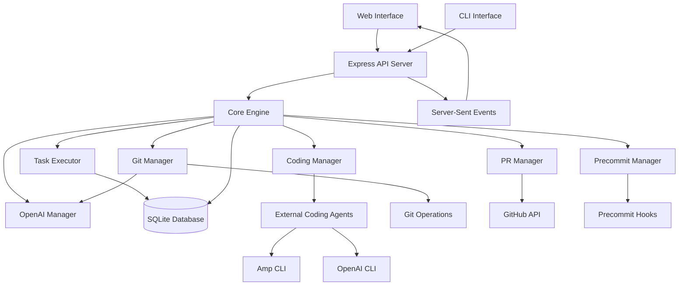
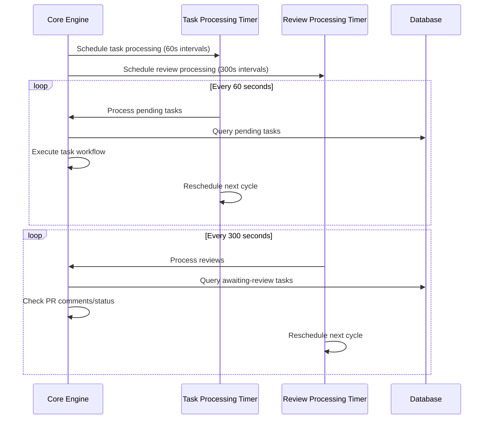
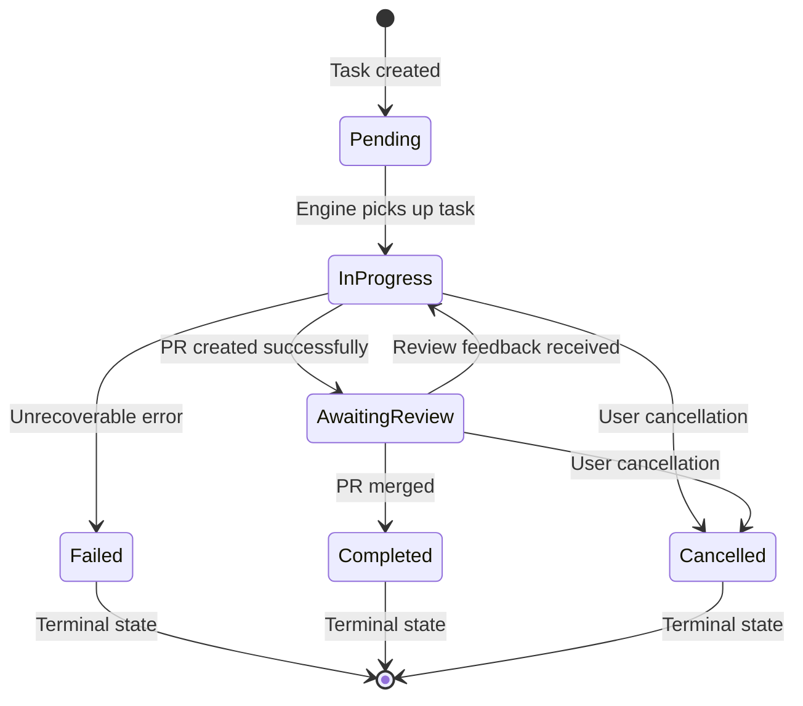
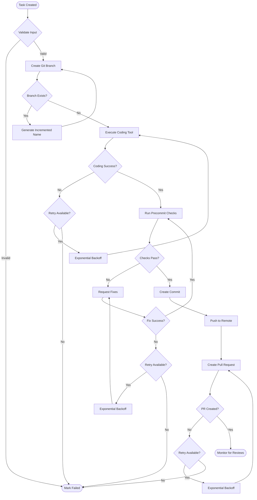
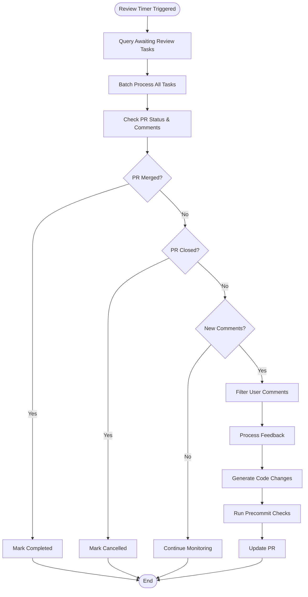
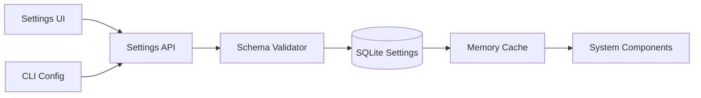
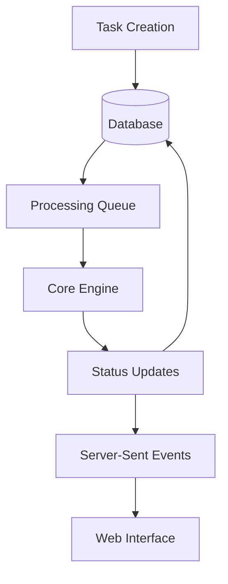
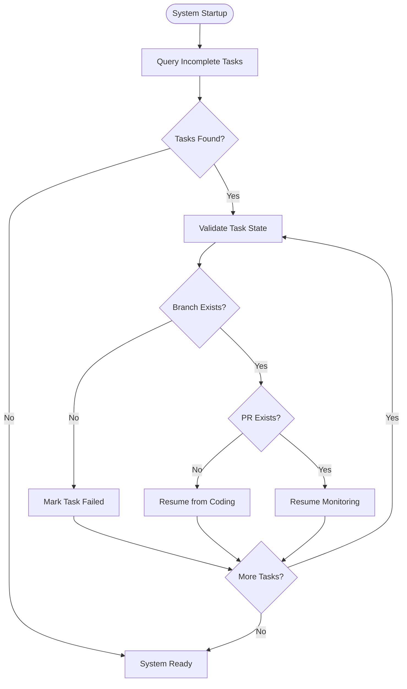
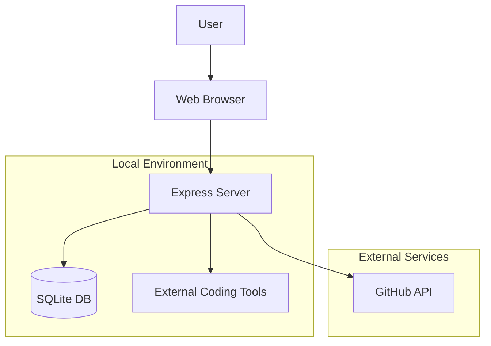

# Intern - Automated Coding Tool System Specification

## Overview
Intern is an automated development workflow orchestration system that integrates CLI coding assistants (OpenAI Codex, Claude Code, Amp Code) to handle the complete development lifecycle from task assignment to PR merge. The system emphasizes resilience, retry mechanisms, and real-time monitoring.

## System Architecture

### High-Level Architecture



### Component Responsibilities

| Component | Primary Responsibilities |
|-----------|-------------------------|
| **Core Engine** | Task orchestration, timeout-based processing, error recovery |
| **Task Executor** | Queue management, overlap prevention, execution coordination |
| **Git Manager** | Branch operations, commit creation, push/pull operations |
| **Coding Manager** | Integration with external coding tools, prompt management |
| **PR Manager** | GitHub PR lifecycle, comment monitoring, merge operations |
| **Precommit Manager** | Code quality validation, check execution, failure handling |
| **OpenAI Manager** | AI-powered commit messages, task summaries, content generation |
| **Database Manager** | Data persistence, schema management, query operations |

## Processing Architecture

### Timeout-Based Processing Model

The system uses separate timeout intervals for different processing types to prevent overlap and ensure reliable execution:



### Task State Machine



## Workflow Specifications

### Task Execution Workflow



### Review Processing Workflow



## Data Architecture

### Database Schema Specification

#### Tasks Table
```sql
CREATE TABLE tasks (
  id INTEGER PRIMARY KEY AUTOINCREMENT,
  title TEXT NOT NULL,
  description TEXT NOT NULL,
  summary TEXT,                    -- AI-generated task summary
  status TEXT NOT NULL,            -- pending, in-progress, awaiting-review, completed, failed, cancelled
  coding_tool TEXT NOT NULL,       -- openai, amp, claude
  current_stage TEXT,              -- current processing stage for UI display
  branch_name TEXT,                -- git branch name
  pr_number INTEGER,               -- GitHub PR number
  pr_url TEXT,                     -- GitHub PR URL
  retry_count INTEGER DEFAULT 0,   -- current retry attempt
  max_retries INTEGER DEFAULT 3,   -- maximum retry attempts
  created_at DATETIME DEFAULT CURRENT_TIMESTAMP,
  updated_at DATETIME DEFAULT CURRENT_TIMESTAMP,
  completed_at DATETIME
);
```

#### Task Logs Table
```sql
CREATE TABLE task_logs (
  id INTEGER PRIMARY KEY AUTOINCREMENT,
  task_id INTEGER NOT NULL,
  level TEXT NOT NULL,             -- info, error, debug, warning
  component TEXT,                  -- git-manager, coding-manager, etc.
  message TEXT NOT NULL,
  details TEXT,                    -- additional structured data
  timestamp DATETIME DEFAULT CURRENT_TIMESTAMP,
  FOREIGN KEY (task_id) REFERENCES tasks(id)
);
```

#### Settings Table
```sql
CREATE TABLE settings (
  key TEXT PRIMARY KEY,
  value TEXT NOT NULL,
  category TEXT NOT NULL,          -- api_keys, general, precommit, github
  data_type TEXT DEFAULT 'string', -- string, number, boolean, json
  is_secret BOOLEAN DEFAULT 0,     -- for secure handling
  updated_at DATETIME DEFAULT CURRENT_TIMESTAMP
);
```

#### Precommit Checks Table
```sql
CREATE TABLE precommit_checks (
  id INTEGER PRIMARY KEY AUTOINCREMENT,
  name TEXT NOT NULL,
  command TEXT NOT NULL,
  required BOOLEAN DEFAULT 1,      -- failure blocks task completion
  enabled BOOLEAN DEFAULT 1,       -- check is active
  timeout_seconds INTEGER DEFAULT 300,
  order_index INTEGER DEFAULT 0,   -- execution order
  created_at DATETIME DEFAULT CURRENT_TIMESTAMP
);
```

#### System Configuration Table
```sql
CREATE TABLE system_config (
  key TEXT PRIMARY KEY,
  value TEXT NOT NULL,
  metadata TEXT,                   -- JSON metadata
  updated_at DATETIME DEFAULT CURRENT_TIMESTAMP
);
```

### Data Flow Specifications

#### Configuration Data Flow


#### Task Data Flow


## API Specifications

### REST API Endpoints

#### Task Management
| Endpoint | Method | Purpose | Request Body | Response |
|----------|--------|---------|--------------|-----------|
| `/api/tasks` | GET | List tasks with filtering/pagination | Query params | TaskList |
| `/api/tasks` | POST | Create new task | TaskCreationRequest | Task |
| `/api/tasks/:id` | GET | Get task details | None | Task |
| `/api/tasks/:id/cancel` | POST | Cancel running task | None | StatusResponse |
| `/api/tasks/:id/retry` | POST | Retry failed task | None | StatusResponse |
| `/api/tasks/:id/logs` | GET | Get task execution logs | Query params | LogList |

#### Settings Management
| Endpoint | Method | Purpose | Request Body | Response |
|----------|--------|---------|--------------|-----------|
| `/api/settings` | GET | Get all settings | None | SettingsMap |
| `/api/settings` | PUT | Update multiple settings | SettingsUpdateRequest | StatusResponse |
| `/api/settings/:category` | GET | Get settings by category | None | SettingsMap |
| `/api/settings/onboarding` | GET | Check onboarding status | None | OnboardingStatus |
| `/api/settings/onboarding` | POST | Complete onboarding | OnboardingData | StatusResponse |

#### System Management
| Endpoint | Method | Purpose | Request Body | Response |
|----------|--------|---------|--------------|-----------|
| `/api/health` | GET | System health check | None | HealthStatus |
| `/api/events` | GET | Server-Sent Events stream | None | EventStream |

### Data Transfer Objects

#### Task Creation Request
```typescript
interface TaskCreationRequest {
  title: string;
  description: string;
  codingTool: 'openai' | 'amp' | 'claude';
  branchPrefix?: string;
  prPrefix?: string;
  autoMerge?: boolean;
}
```

#### Task Response
```typescript
interface Task {
  id: number;
  title: string;
  description: string;
  summary?: string;
  status: TaskStatus;
  codingTool: string;
  currentStage?: string;
  branchName?: string;
  prNumber?: number;
  prUrl?: string;
  retryCount: number;
  maxRetries: number;
  createdAt: string;
  updatedAt: string;
  completedAt?: string;
  progress?: TaskProgress;
}
```

#### Server-Sent Event Format
```typescript
interface TaskUpdateEvent {
  type: 'task-update' | 'log-entry' | 'system-status';
  taskId?: number;
  data: {
    status?: TaskStatus;
    progress?: TaskProgress;
    metadata?: any;
    logEntry?: LogEntry;
  };
}
```

## Integration Specifications

### External Coding Tools Integration

#### Tool Interface Contract
```typescript
interface CodingToolAdapter {
  name: string;
  isAvailable(): Promise<boolean>;
  generateCode(prompt: string, context: CodeContext): Promise<CodeResponse>;
  fixIssues(issues: Issue[], context: CodeContext): Promise<CodeResponse>;
}
```

#### Code Context Structure
```typescript
interface CodeContext {
  taskDescription: string;
  existingFiles: FileInfo[];
  changedFiles: FileInfo[];
  errorMessages?: string[];
  previousAttempts?: number;
}
```

### GitHub Integration Specifications

#### PR Management Interface
```typescript
interface PRManager {
  createPR(branch: string, title: string, description: string): Promise<PR>;
  updatePR(prNumber: number, updates: PRUpdate): Promise<PR>;
  getComments(prNumber: number, since?: Date): Promise<Comment[]>;
  mergePR(prNumber: number, options: MergeOptions): Promise<MergeResult>;
}
```

#### Comment Processing Rules
- Only process comments from configured GitHub username
- Ignore bot comments and automated messages
- Parse natural language feedback into actionable tasks
- Track comment processing to avoid duplicates

### Git Operations Specifications

#### Branch Management Strategy
- **Naming Convention**: `{prefix}{task-slug}-{increment}`
- **Conflict Resolution**: Auto-increment suffix for duplicate names
- **Cleanup Policy**: Preserve branches until task completion/cancellation

#### Commit Strategy
- **Message Generation**: AI-powered via OpenAI integration
- **Suffix Application**: Configurable suffix for identification
- **Atomic Commits**: One commit per task iteration
- **Deduplication**: Prevent duplicate suffixes in messages

## Error Handling & Resilience

### Retry Strategy Specifications

#### Exponential Backoff Configuration
```typescript
interface RetryConfig {
  maxAttempts: number;        // Default: 3
  baseDelay: number;          // Default: 1000ms
  maxDelay: number;           // Default: 30000ms
  jitterFactor: number;       // Default: 0.1
  exponentialBase: number;    // Default: 2
}
```

#### Retry Trigger Conditions
| Scenario | Detection Method | Retry Strategy |
|----------|------------------|----------------|
| API Rate Limiting | HTTP 429 response | Respect Retry-After header |
| Network Timeouts | Request timeout | Standard exponential backoff |
| Git Conflicts | Git command failure | Branch name increment |
| Tool Unavailable | Command not found | Fail fast, no retry |
| Precommit Failures | Non-zero exit code | Request fixes, retry checks |

### Error Recovery Workflows

#### Startup Recovery Process


#### Failure Classification
| Category | Examples | Recovery Action |
|----------|----------|-----------------|
| **Transient** | Network errors, API timeouts | Automatic retry with backoff |
| **Configuration** | Invalid API keys, missing tools | Fail fast, notify user |
| **Code Quality** | Linting failures, type errors | Request AI fixes, retry |
| **External** | GitHub API errors | Retry with backoff |
| **Fatal** | Corrupted repository, disk full | Fail task, alert user |

## Security Considerations

### Data Protection
- **API Keys**: Encrypted storage with file system permissions
- **Secrets Handling**: Never log or expose in error messages
- **Input Validation**: Sanitize all user inputs and external responses
- **Process Isolation**: Sandbox external tool execution

### GitHub Security
- **Token Scope**: Minimum required permissions (repo access)
- **Webhook Verification**: HMAC signature validation
- **Rate Limiting**: Respect GitHub API limits
- **Access Control**: User-based comment filtering

## Performance Specifications

### Resource Requirements
- **Memory**: 256MB base + 50MB per active task
- **CPU**: Minimal during idle, burst during processing
- **Disk**: 100MB for application + log storage
- **Network**: GitHub API + coding tool API bandwidth

### Scalability Limits
- **Concurrent Tasks**: 10 tasks (configurable)
- **Database Size**: SQLite practical limit (~100GB)
- **Log Retention**: 30 days default, configurable
- **API Rate Limits**: GitHub (5000/hour), OpenAI (configurable)

### Performance Monitoring
```typescript
interface PerformanceMetrics {
  taskCompletionTime: number;      // Average task duration
  apiResponseTime: number;         // External API latency
  retryRate: number;              // Percentage of tasks requiring retries
  errorRate: number;              // Percentage of failed tasks
  queueDepth: number;             // Number of pending tasks
}
```

## Configuration Specifications

### Settings Categories

#### API Keys Category
```typescript
interface APIKeysSettings {
  githubToken: string;              // Required
  openaiApiKey?: string;           // Optional
  claudeApiKey?: string;           // Optional
  ampApiKey?: string;              // Optional
}
```

#### General Settings Category
```typescript
interface GeneralSettings {
  defaultCodingTool: 'openai' | 'amp' | 'claude';
  branchPrefix: string;            // Default: 'intern/'
  prPrefix: string;                // Default: '[INTERN]'
  commitSuffix: string;            // Default: ' [i]'
  baseBranch: string;              // Default: 'main'
  autoMerge: boolean;              // Default: false
  maxRetries: number;              // Default: 3
  pollInterval: number;            // Default: 30 seconds
}
```

#### GitHub Settings Category
```typescript
interface GitHubSettings {
  githubRepoUrl: string;           // Required
  githubUsername: string;          // Required for comment filtering
  webhookSecret?: string;          // Optional for webhook verification
}
```

### Configuration Validation Rules
- **GitHub Token**: Validate permissions and repository access
- **API Keys**: Test connectivity and authentication
- **Repository URL**: Validate format and accessibility
- **Numeric Settings**: Range validation and type checking
- **Required Fields**: Enforce completion before system operation

## Development Considerations

### Technology Stack Rationale
| Technology | Justification |
|------------|---------------|
| **TypeScript** | Type safety, developer experience, tooling ecosystem |
| **Express.js** | Lightweight, mature, extensive middleware support |
| **SQLite** | Zero configuration, ACID compliance, local storage |
| **Server-Sent Events** | Real-time updates, simpler than WebSockets |
| **Tailwind CSS** | Rapid prototyping, consistent design system |

### Deployment Architecture


### Extensibility Points
- **Coding Tool Adapters**: Plugin system for new AI services
- **Precommit Checks**: Configurable validation pipeline
- **Notification Channels**: Email, Slack, Discord integrations
- **Git Providers**: GitLab, Bitbucket support
- **Authentication**: OAuth, SSO integration

This specification provides a comprehensive blueprint for implementing the Intern system while maintaining flexibility for future enhancements and ensuring robust, reliable operation in production environments.
